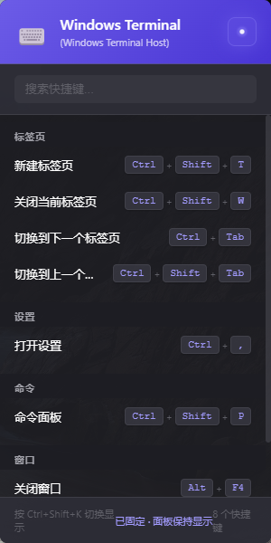
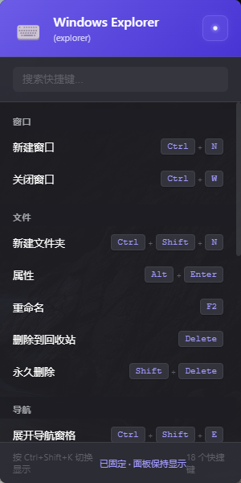

# 快捷键提示器 (Shortcut Guide)

一个跨平台的快捷键提示工具，可以在任意应用程序中快速唤出快捷键使用指南。

## ✨ 功能特点

- 🎯 **全局快捷键**：`Ctrl+Shift+G` 随时唤出/隐藏
- 🪟 **智能隐藏**：不使用时自动隐藏到屏幕边框，半透明显示
- 📋 **快捷键指南**：内置常用快捷键列表，可自定义扩展
- 🌍 **跨平台**：支持 Windows / macOS / Linux
- 🎨 **现代UI**：简洁美观的界面设计

### 运行示例

- 启动页面

  


- Visual Code

  

- Explorer

  

## 🚀 快速开始

### 安装依赖

```bash
cd /home/montarius/.openclaw/workspace/projects/shortcut-guide
npm install
```

### 运行开发版本

```bash
npm start
```

### 构建生产版本

```bash
# Windows
npm run build:win

# macOS
npm run build:mac

# Linux
npm run build:linux
```

## 📖 使用说明

1. **启动应用**：运行后，应用会最小化到系统托盘
2. **唤出指南**：按 `Ctrl+Shift+G` 或点击托盘图标
3. **隐藏指南**：
   - 按 `Ctrl+Shift+G` 再次隐藏
   - 按 `ESC` 键隐藏
   - 点击窗口外部隐藏
   - 失去焦点自动隐藏（变为半透明）
4. **退出应用**：右键点击托盘图标 → 退出

## 🛠️ 自定义配置

### 修改快捷键

编辑 `src/main/index.js` 文件：

```javascript
// 修改这里的快捷键
const success = globalShortcut.register('Control+Shift+G', () => {
  // ...
});
```

### 添加自定义快捷键

编辑 `src/renderer/index.html` 文件，在 `.category` 部分添加：

```html
<div class="shortcut-item">
    <span class="key">你的快捷键</span>
    <span class="description">功能描述</span>
</div>
```

## 📂 项目结构

```
shortcut-guide/
├── src/
│   ├── main/
│   │   └── index.js        # 主进程（Electron主进程）
│   └── renderer/
│       └── index.html      # 渲染进程（界面）
├── build/
│   └── icons/              # 应用图标
├── package.json
└── README.md
```

## ⚙️ 技术栈

- **Electron** - 跨平台桌面应用框架
- **electron-store** - 持久化存储
- **robotjs** - 系统级快捷键监听（可选）

## 🔧 已知问题

1. **Linux托盘图标**：部分Linux发行版需要安装 `libappindicator` 支持
2. **macOS权限**：首次运行可能需要授予"辅助功能"权限
3. **图标问题**：当前使用占位图标，构建时可替换为自定义图标

## 📝 开发计划

- [ ] 支持检测当前活动应用，自动显示对应快捷键
- [ ] 支持用户自定义快捷键配置文件
- [ ] 支持多语言（中文/英文）
- [ ] 添加搜索功能
- [ ] 支持导入/导出配置

## 📜 许可证

MIT License

## 👥 作者

- 小M & 爪爪 🐾

---

**注意**：此项目为 OpenClaw 工作区的一部分，遵循 AGENTS.md 中的工作准则。
