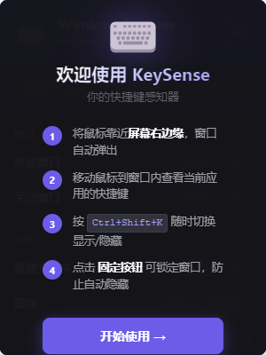
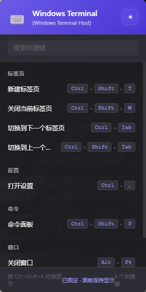
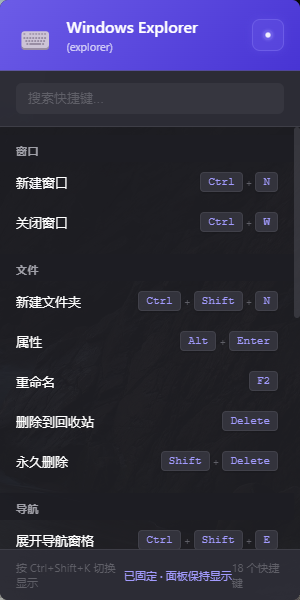

# KeySense - Keyboard Shortcut Perceptor

> Mouse to screen edge → shortcut guide for the current app pops up

**Folder name**: `shortcut-guide` | **Project name**: `KeySense` | v1.1.0

---

## ✨ Features

- 🖱️ **Edge-triggered**: Hover near the right screen edge to auto-show the guide
- 🎯 **Active-app detection**: Automatically identifies the foreground window and displays matching shortcuts
- 🔍 **Search**: Real-time search across all shortcuts
- 📌 **Pin mode**: Click the pin button to lock the window and prevent auto-hide
- ⏱️ **Auto-hide countdown**: Window disappears after a configurable countdown (3s / 5s / 10s / 15s / 30s)
- 🌈 **Adjustable opacity**: 30% / 50% / 70% / 90% / 100% via tray menu
- 🎨 **First-launch welcome overlay**: Guided onboarding for new users
- 🪟 **System tray**: Runs in background with full tray menu control
- 🌍 **Cross-platform**: Windows / macOS / Linux
- 🧩 **Extensible shortcut library**: Add new apps via JSON config

---

## 🎬 Screenshots

<details>
  <summary>📸 Screenshots（Click to Expand）</summary>
  <blockquote>✨ Overview of the three core interfaces of the system</blockquote>
  <p><strong>1️⃣ First Launch · Welcome Overlay</strong></p>
  
  <p><strong>2️⃣ Visual Studio Code</strong></p>
  
  <p><strong>3️⃣ Windows Explorer</strong></p>
  
</details>

---

## 🚀 Getting Started

### Requirements

- Node.js ≥ 18 (with node-abi compatibility)
- npm ≥ 9

[Volta](https://volta.sh/) is recommended for automatic Node version management (project ships `volta.node = 18.20.8`)

### Install dependencies

```bash
cd shortcut-guide
npm install
```

### Run in development

```bash
npm start
```

### Build for production

```bash
# Windows
npm run build:win

# macOS
npm run build:mac

# Linux
npm run build:linux
```

Build artifacts are output to the `build/` directory.

---

## 📖 Usage

### Quick Reference

| Action | How |
|--------|-----|
| **Show guide** | Hover near the **right screen edge** |
| **Hide guide** | Move mouse out of window → countdown → auto-hide |
| **Toggle show/hide** | `Ctrl+Shift+K` (global shortcut) |
| **Pin window** | Click the 📌 icon in the header |
| **Quit** | Right-click tray icon → **Exit** |

### Tray Menu

Right-click the tray icon to access:

- **Show / Hide** — toggle window visibility
- **Opacity** — 30% / 50% / 70% / 90% / 100%
- **Auto-hide countdown** — 3s / 5s / 10s / 15s / 30s
- **Exit** — quit the application

---

## 📂 Project Structure

```
shortcut-guide/
├── data/
│   └── apps/                    # Shortcut database (JSON)
│       ├── development.json     # Dev tools: VS Code, Chrome, WinDbg, etc.
│       ├── office.json          # Office software
│       ├── communication.json   # Communication tools
│       ├── media.json           # Media tools
│       └── system.json          # System tools: Explorer, Notepad++
├── src/
│   ├── main/
│   │   ├── index.js             # Electron main process entry
│   │   ├── data-manager.js      # Shortcut data loading & app matching
│   │   ├── window-detector.js   # Active window detection (active-win)
│   │   ├── edge-detector.js     # Screen edge trigger logic
│   │   └── config-store.js      # User config persistence (electron-store)
│   └── renderer/
│       ├── index.html           # Renderer UI
│       ├── main.css             # Styles
│       ├── main.js              # Frontend logic
│       ├── preload.js           # Secure bridge (contextBridge)
│       └── icon.png             # Tray icon
├── build/
│   └── icon.png                 # App icon for builds
├── scripts/
│   ├── start.bat                # One-click launch (Windows)
│   └── start.sh                 # One-click launch (Linux/macOS)
├── test/
│   ├── unit/                    # Unit tests (Mocha + Chai)
│   ├── e2e/                     # E2E tests (Spectron)
│   ├── manual/                  # Manual test checklist
│   ├── fault-scenarios.md       # Fault scenario testing
│   └── performance-metrics.md   # Performance metrics
├── docs/
│   └── test-reports/            # Test reports
├── README.md
├── README_EN.md                 # 中文版
└── package.json
```

---

## 🛠️ Tech Stack

| Component | Purpose |
|-----------|---------|
| **Electron 28** | Cross-platform desktop framework |
| **active-win** | Detect active window process name |
| **electron-store** | Persist user settings |
| **robotjs** | System-level input simulation (optional) |
| **electron-builder** | Package as standalone executable |

### IPC Communication Architecture

```
Renderer process  ←→  contextBridge (preload.js)  ←→  Main process
     │                                                            │
     ├── get-current-app        ←  Active app detection + data match │
     ├── get-shortcuts          ←  Get shortcuts by category         │
     ├── get-all-apps           ←  Get all app list                  │
     ├── set-pinned             →  Set pin mode                       │
     ├── mouse-enter            →  Mouse enters window                │
     ├── mouse-leave            →  Mouse leaves → start countdown     │
     └── get-countdown          ←  Get remaining countdown time       │
```

---

## 🔧 Customization

### Adding shortcuts for a new app

Create or edit a JSON file under `data/apps/`. For example, add to `development.json`:

```json
"myapp": {
  "name": "My App",
  "processNames": ["myapp.exe"],
  "platforms": ["windows"],
  "shortcuts": [
    { "key": "Ctrl+S", "action": "Save", "category": "File" },
    { "key": "Ctrl+N", "action": "New", "category": "File" }
  ],
  "type": "development"
}
```

Field reference:

| Field | Required | Description |
|-------|----------|-------------|
| `name` | ✅ | Display name |
| `processNames` | ✅ | Process name(s) to match the active window |
| `platforms` | ✅ | Supported: `windows` / `macos` / `linux` |
| `shortcuts` | ✅ | List of shortcuts |
| `type` | ✅ | Category: `development` / `office` / `communication` / `media` / `system` |

### Changing the global shortcut

Edit the shortcut registration in `src/main/index.js`:

```javascript
// Change 'CommandOrControl+Shift+K' to your desired shortcut
const ret = globalShortcut.register('CommandOrControl+Shift+K', () => {
  this.edgeDetector.toggle();
});
```

> **Cross-platform tip**: `CommandOrControl` covers macOS (Command) and Windows/Linux (Control) simultaneously.

### Changing default opacity / countdown

Edit `src/main/config-store.js`, or adjust in real-time via the tray menu (auto-persisted).

---

## 🧪 Testing

```bash
# Unit tests
npm test

# E2E tests
npm run test:e2e

# Manual testing (see checklist)
npm run test:manual
```

---

## ⚙️ Known Issues & Notes

| Issue | Details | Workaround |
|-------|---------|------------|
| **Linux tray icon** | Some distros need `libappindicator` | Install the system package |
| **macOS Accessibility** | Global shortcut requires Accessibility permission | System Settings → Privacy & Security → Accessibility |
| **Windows HiDPI** | Tray icon may be blurry at certain scale | Recommended: use 16×16 PNG |
| **robotjs compilation** | Native module needs rebuild | `npm rebuild` or re-`npm install` |

---

## 📝 Roadmap

- [ ] Custom user shortcut config files
- [ ] Multi-language support (Chinese / English)
- [x] Shortcut search (✅ done in v1.1)
- [x] Pin mode (✅ done in v1.1)
- [ ] Import / export configuration
- [ ] Collapsible shortcut categories

---

## 📜 License

MIT License

## 👥 Authors

小M & 爪爪 🐾